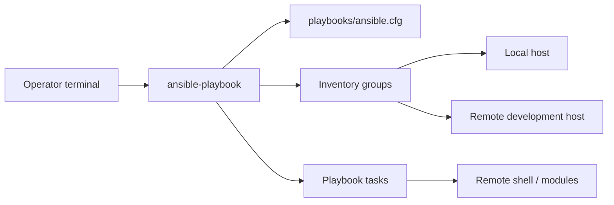
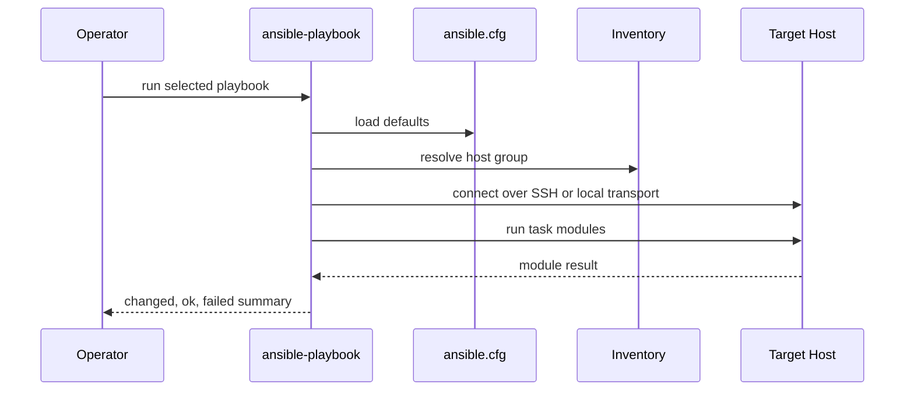

# Ansible Repository Architecture

## Purpose

This repository captures starter infrastructure automation patterns using
Ansible playbooks, inventory files, and local or remote host execution. It is a
foundation for repeatable validation, remote command execution, and deployment
workflows.

The current design is intentionally small:

- a local ping playbook for connectivity checks
- a hello-world debug playbook for baseline execution
- a remote command playbook for SSH and privilege-escalation practice
- inventory files for grouping target hosts
- `ansible.cfg` for shared runtime defaults

## Repository Map

```text
.
├── test.yml
└── playbooks
    ├── ansible.cfg
    ├── helloworld.yml
    ├── ssh_renmote_login.yml
    └── inventory
        ├── ansible-hosts
        ├── .ansible-hosts
        ├── log.txt
        └── log1.txt
```

## System Context



## Execution Layers

### Control Node

The control node is the machine running `ansible-playbook`. It loads
configuration from `playbooks/ansible.cfg` when commands are run from that
directory.

Important control-node concerns:

- Python and Ansible installation
- SSH client configuration
- inventory file selection
- host-key checking policy
- log capture and terminal output

### Inventory Layer

Inventory files define the target host groups. The current playbooks reference:

- `all`
- `local`
- `development_database_host`

The architecture should keep host names, IP addresses, and credentials outside
the playbooks where possible. Inventory and variables should own environment
specific data.

### Playbook Layer

Playbooks define repeatable operations:

- `test.yml` uses a ping task against the `local` group.
- `playbooks/helloworld.yml` validates basic task execution with
  `ansible.builtin.debug`.
- `playbooks/ssh_renmote_login.yml` demonstrates remote command execution,
  fact gathering, privilege escalation, command registration, and debug output.

### Module Layer

The repository uses built-in Ansible modules:

- `ansible.builtin.debug`
- `ansible.builtin.command`
- `ping`

These modules keep tasks declarative enough to be reused and tested.

## Runtime Flow



## Configuration Contract

`playbooks/ansible.cfg` currently defines:

| Setting | Role |
| --- | --- |
| `inventory = inventory/ansible-hosts` | Default inventory location |
| `host_key_checking = False` | Reduces first-run friction for lab hosts |
| `retry_files_enabled = False` | Avoids generating retry files |
| `remote_tmp = ~/.ansible/tmp` | Sets remote temporary directory |

For production use, host-key checking should usually be re-enabled or managed
with known host provisioning.

## Security Model

This repo should treat the following as sensitive:

- real IP addresses
- real usernames
- SSH private keys
- host logs that reveal network topology
- privileged command output

Recommended hardening:

- move secrets into Ansible Vault or external secret storage
- keep inventory host variables out of public commits when they identify real
  infrastructure
- avoid `become: true` unless the task requires it
- add `--check` mode compatibility where practical
- add idempotent modules instead of raw commands for package, file, and service
  changes

## Growth Path

The architecture can grow into a full automation repository by adding:

1. `inventories/dev`, `inventories/stage`, and `inventories/prod`.
2. `group_vars` and `host_vars` for environment specific configuration.
3. roles for common concerns such as users, packages, firewall, services, and
   deployment.
4. Molecule tests for role behavior.
5. `ansible-lint` and syntax checks in CI.
6. deployment playbooks for web apps, BMS services, or embedded Linux support
   hosts.

## Validation Strategy

Run these checks before using a new playbook against a real host:

```bash
ansible-playbook --syntax-check playbooks/helloworld.yml
ansible-playbook -i playbooks/inventory/ansible-hosts test.yml --check
ansible-playbook -i playbooks/inventory/ansible-hosts playbooks/helloworld.yml
```

For remote hosts, validate connectivity first, then run command-changing tasks.

## Architecture Decision Record

| Decision | Current Choice | Reason |
| --- | --- | --- |
| Automation engine | Ansible | Agentless SSH workflow and readable YAML |
| Inventory | File-based inventory | Simple to inspect and version |
| Starter modules | debug, ping, command | Good first coverage for validation and remote execution |
| Privilege escalation | Used only in remote command example | Demonstrates `become` without applying broad system changes |
| Environment model | Lab/development oriented | Keeps the repository safe for learning and iteration |

